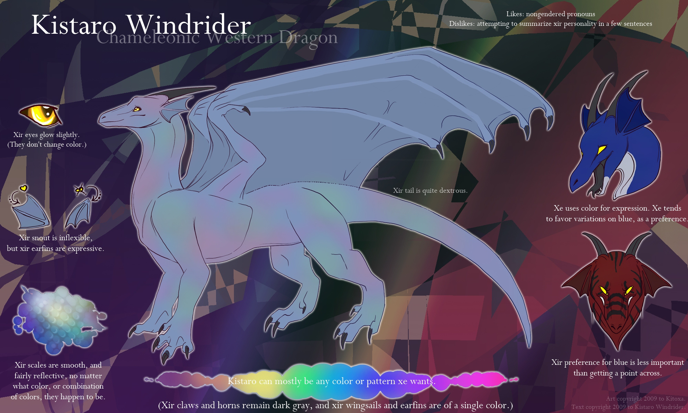
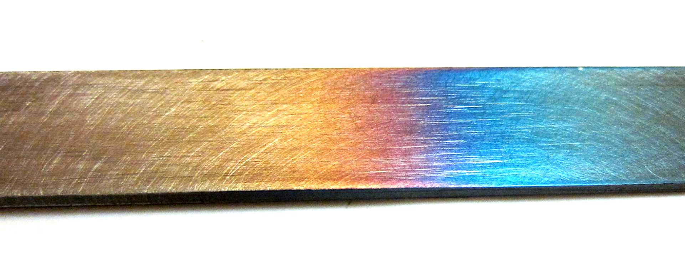
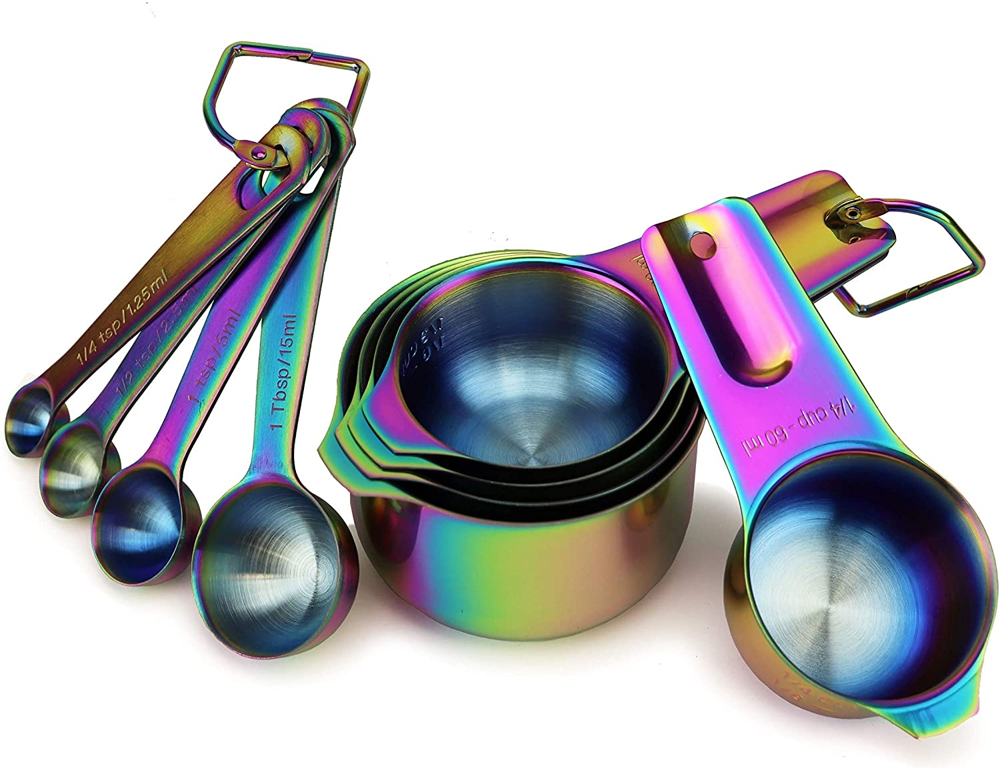
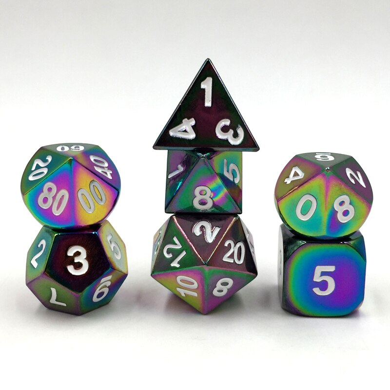

# Kistaro, dragon spacecraft
Kistaro Windrider, but the spacecraft version. This concept is somewhat vague and up for a lot of interpretation. I am poor at visualizing things as a whole, and I rely on artist’s intuition to make up an awful lot of gaps! So this is a few reference images and a lot of bulleted lists.

First off, this is a spacecraft of somewhat indeterminate size, but capable of carrying passengers, strongly resembling this particular dragon (hi!):

Aim for somewhere between “spaceworthy synth dragon” and “spacecraft with a vaguely draconic shape”. Would be clumsy on land, but can indeed land and wander around on the surface (and does, to pick up and drop off passengers and cargo, to refuel, and just to explore.)

**Head:** 
	* Horns and earfins are a radio sensor array.
	* Face is a dark, glass-like, translucent material, which is a viewing window from the (manned) bridge. (The shipboard AI has authority over the people on the bridge, though, and can override the crew - the ship is a person and has rights!) Also serves as a display surface, used mostly for displaying a face. (Take inspiration from Vader-San’s Synth species for this.)
	* Mouth opens, revealing a staircase (with moving platform available for cargo loading or mobility-impaired passengers) to get to the bridge. This is also where a tractor beam / repulsion beam / matter disruption beam (weapon) is mounted.

**Hull:** Dragon-shaped! Plated with mirror-y, multicolored metal, strongly resembling heat-tempered steel designed to look colorful, like these distressingly normal items that were the best references I could pull off Google Images:

Primarily in the cyan-to-violet range but with plenty of variation and suggestions of iridescence. (I expect this to be annoying to draw, will pay accordingly)

**Tail:** Resembling a synth’s tail (Vader-San’s species again), plated with the same metal as the hull. Has thrusters mounted along various points of it for fine steering and minor propulsion (a necessary side effect of steering in a vacuum). 

**Wings:** Wingsails are projected from emitters on wing-“bones” and sides.  Translucent, glow-y, cyan-and-violet force field look; part of the warp drive. (Some kind of spatial distortion generator.)

**Legs:** Usually folded to the body while in flight, but not always; has grabby claws for, well, grasping things! Each “palm” has a retractable set of wheels, resembling nothing quite so much as roller skates, used as takeoff/landing gear. (And, occasionally, roller skates.)

**Thighs:** Fluid storage: oxygen, nitrogen, water, fuel, etc. Will show connection points for hoses, possibly capacity displays.

**Belly:** Large hatch, opening downwards, allowing access to the primary cargo bay, with large-cargo lift, another staircase for entrance, and emergency ladders. From the exterior, there are warning lights (usually off), so folks don’t get caught under it when it’s lowering.

**Unnecessary glowy parts and decorations:** Like a gaming PC.

Back to [[START-HERE]]