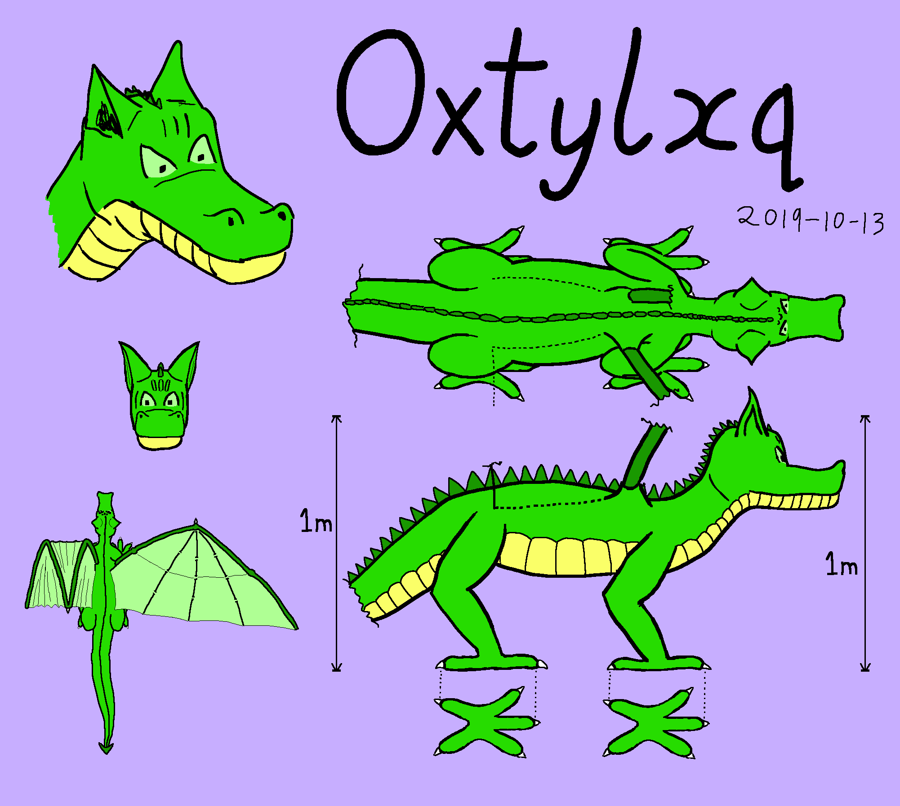

# Oxtylxq

The organic form of Oxtylxq's character (credit Oxtylxq)

The proposed spaceship form of Oxtylxq's character (credit Oxtylxq)

A different angle on the proposed spaceship form (credit Oxtylxq)

**Artist's notes:**
What I have attempted to draw above.

This is a spaceship that looks quite dragon-y from some angles, but is still a plausible design. It has no top or bottom in its design, only front and back, with 4-sided rotational symmetry around the front-to-back axis. It is not intended to land or enter the atmosphere.

It has a cylindrical "body" in yellow, a slightly tapered "tail" on the back end of the body, and a cylindrical-ish "head" on the front end of the body. The windows on the head (from some angles) look like eyes. The things sticking out of the head look a bit like ears or horns (but there are four of them placed symmetrically) and the large cooling radiators somewhat resemble wings (but again there are four of them, placed symmetrically). The conical rocket at the back looks rather like a tail-spade and emits pale blue rocket flame/exhaust.

The heat radiators have ridges that look a bit like the bones in a dragon's wings, but their arrangements is similar to the veins in a leaf (because they are a network pipes to circulate coolant out to the wings to cool and back into the body to be re-used).

Back to [[START-HERE]]

[//begin]: # "Autogenerated link references for markdown compatibility"
[START-HERE]: START-HERE.md "START HERE"
[//end]: # "Autogenerated link references"