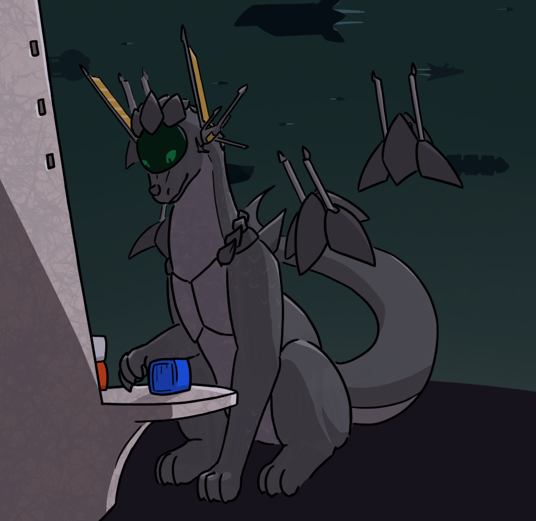

# Rakeela

Picture credit to Vox Somniator, who ran a very appealing "Caroli Retrofits" series of images that offered spaceship-ized versions of characters.

As a spaceship, Rakeela comes with openable chestplates to access a habitable interior, as well as a wing of minor escort/sensor ships that fly in formation.  The ship requires no crew and tolerates no crew.