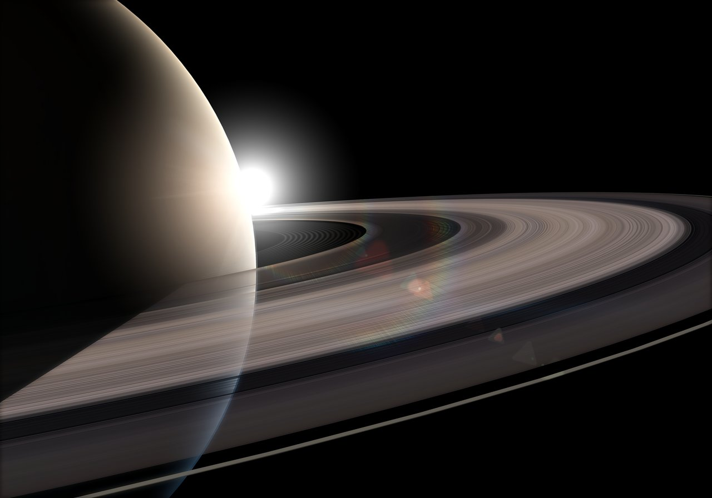
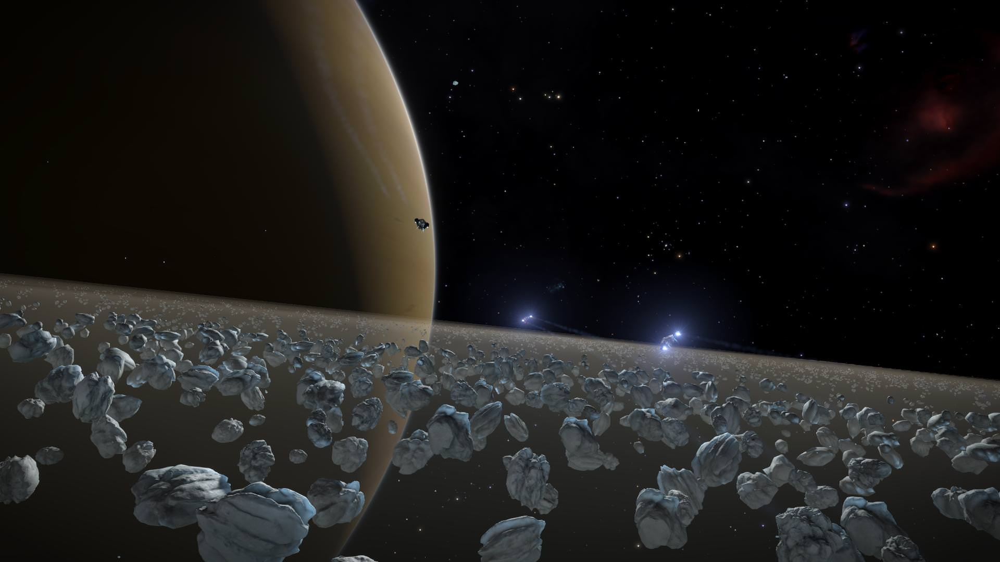
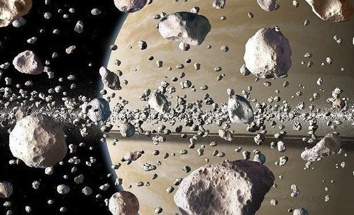
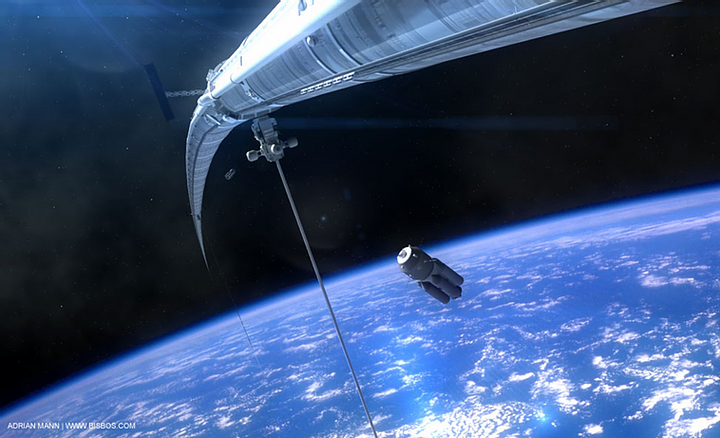
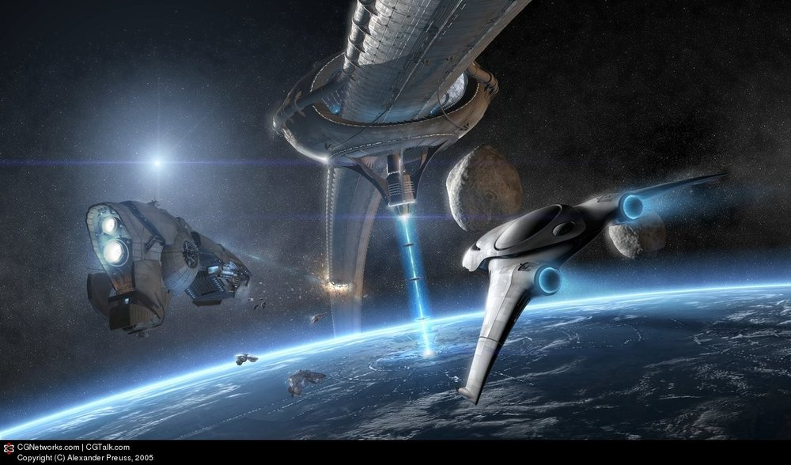

# Saturn

The first group picture of the spaceship dragons is currently proposed to be in orbit of Saturn, overlooking the rings.  They're gathered to pose for a picture, society being post-scarcity enough to tolerate this.

- Alternative proposal #1: The group is visiting a gas-harvesting ring installed around Saturn in an elliptical orbit.  It touches the atmosphere just barely at two points, and is otherwise very wide.

- Alternative proposal #2:  The group is visiting the catcher-ring described below.  They're picking up materials to deliver elsewhere in the system.  The picture is composited facing the sun, looking out past a small portion of this ring structure across the gleaming surface of Saturn's icy rings.  Some of the characters should be near Ahkvenir, looking towards the camera, while others should be in transit or docked on the mining ring.

In this setting, Saturn has had an artificial orbital ring installed around it inside of the planet's ring system.  This artificial ring absorbs infalling particles from Saturn's rings.  The primary output of the catcher-ring station is water, which it produces in awesome quantities, though it also produces stone and metal in 'small' quantities as the infalling ring matter includes some amount of captured meteors.  The ring is covered in habitats on its leeward side (facing the planet) and serves as the central base for resource extraction in the Saturn region.

**Saturn images:**
* 
*  (Credit: Elite Dangerous)
* 

**Orbital ring image:**
* 
* 

**Proposal #2 concept image:**
*  (Credit: Rakeela)

Back to [[START-HERE]]

[//begin]: # "Autogenerated link references for markdown compatibility"
[START-HERE]: START-HERE.md "START HERE"
[//end]: # "Autogenerated link references"